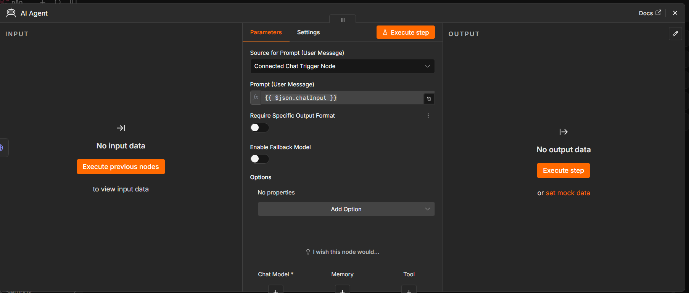
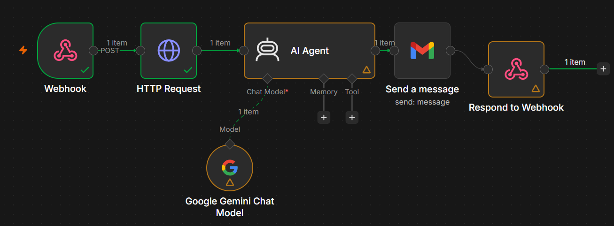
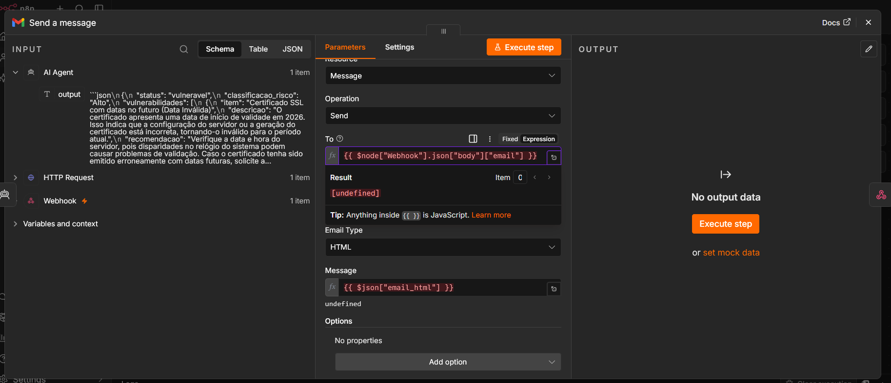
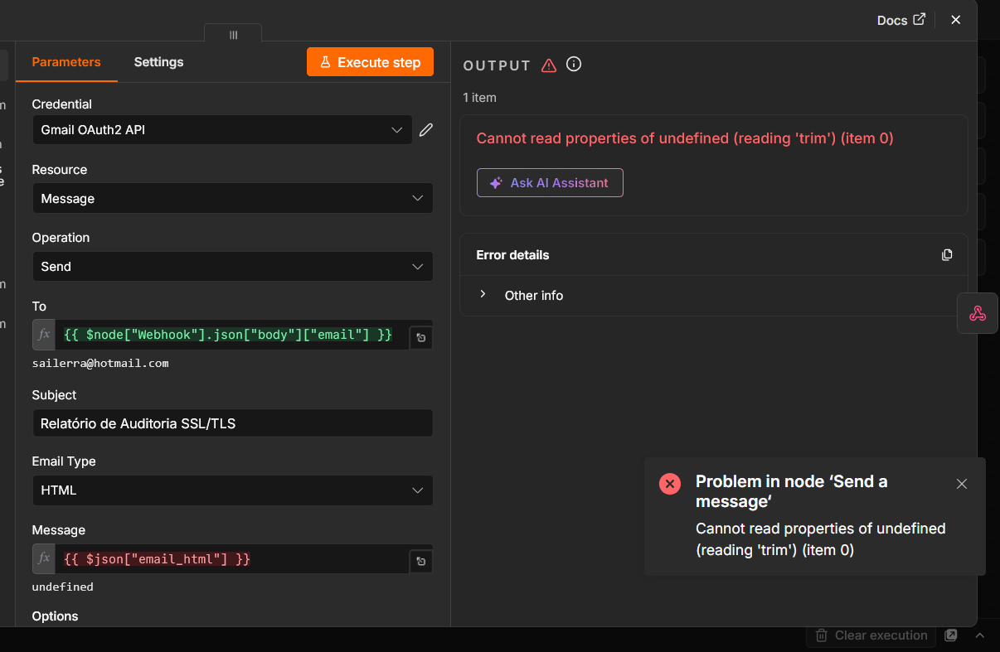
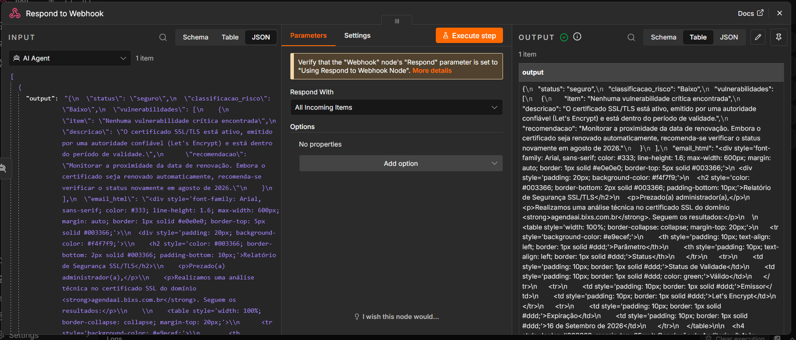
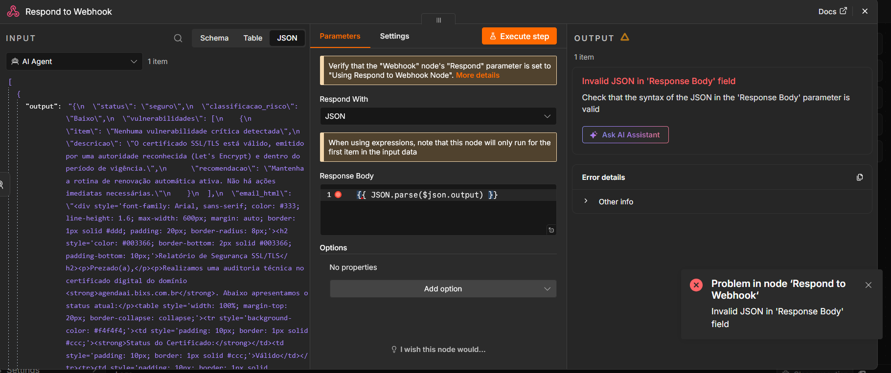
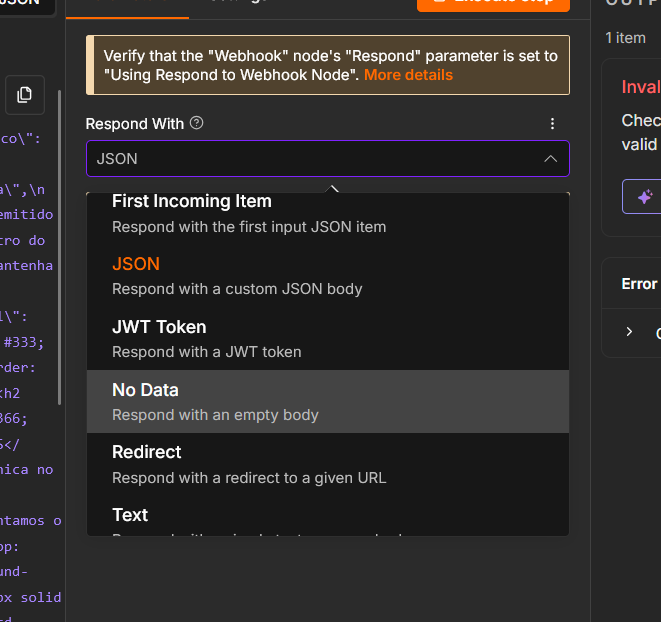

# Prompt Utilizado para configurar N8N
### pergunta 1
Vamos ao cenário 1, a automação n8n como eu faço? junto foi anexado um arquivo com as instruções do projeto(arquivo do professor editado com os dados necessários)
### Reposta 1
Como você quer algo **simples e rápido**, sem a necessidade de programar um backend para rodar ferramentas reais de scan (como OpenSSL ou Nmap), o caminho mais eficiente no n8n é criar um fluxo que recebe o domínio do seu frontend, repassa para um nó de IA (como o Gemini ou OpenAI) simular a análise, e devolve o relatório formatado em JSON.

Aqui está a estrutura passo a passo de como você deve montar esse workflow no n8n:

---

## Estrutura do Workflow no n8n

O seu fluxo no n8n precisará de apenas **4 nós principais**:

```
[ Webhook ] ➔ [ AI Agent ] ➔ [ Respond to Webhook ]
                     │
              [ OpenAI/Gemini Chat Model ]

```

### 1. Nó: Webhook (A Entrada)

Este nó será a porta de entrada que o seu frontend vai chamar.

* **HTTP Method:** `POST`
* **Path:** `auditoria-ssl`
* **Respond:** Escolha a opção *Using 'Respond to Webhook' Node* (isso garante que o frontend espere a IA terminar para receber o relatório).
* *O que ele faz:* Recebe o corpo da requisição do frontend contendo o domínio (ex: `{"url": "exemplo.com"}`).


### 2. Nó: AI Agent (O Cérebro)

Este é o nó principal de IA do n8n. Ele vai juntar o domínio recebido com as instruções de segurança.

* **Prompt:** Você usará uma expressão para capturar a URL vinda do Webhook. Exemplo:


> `"Atue como um especialista em segurança digital. Faça uma análise simulada de segurança SSL/TLS e certificados para o seguinte domínio: {{ $json.body.url }}. Gere um relatório detalhado."`
> 


### 3. Nó: OpenAI Chat Model ou Google Gemini Chat Model

Arraste este nó e conecte-o diretamente **abaixo** do *AI Agent* (na engrenagem de modelo).

* Conecte sua API Key (da OpenAI ou Google AI Studio).
* **Model:** Escolha um modelo rápido e barato (como `gpt-4o-mini` ou `gemini-1.5-flash`).

### 4. Nó: Respond to Webhook (A Saída)

Conecte este nó logo após o *AI Agent*. Ele devolverá a resposta diretamente para o seu frontend.

* **Response Body:** Escolha *First Entry JSON*.
* *O que ele faz:* Envia o relatório gerado pela IA de volta para o frontend exibir na tela.


---

## O "Pulo do Gato": Forçando a IA a responder em JSON

Para que o seu frontend consiga renderizar os cards de vulnerabilidades e a classificação de risco facilmente, a IA **precisa** responder em um formato estruturado (JSON).

Para garantir isso, configure o **System Message** (ou o prompt principal) do seu *AI Agent* exatamente assim:

> **System Prompt:**
> Você é um agente de IA focado em auditoria de segurança de Servidores Web. Sua tarefa é gerar um relatório de vulnerabilidades estruturado estritamente em formato JSON. Não adicione nenhuma saudação, texto introdutório ou blocos de código (como ```json). Retorne apenas o objeto JSON puro.
> 
> 
> O JSON deve seguir rigidamente esta estrutura:
> {
> "status": "vulneravel" ou "seguro",
> "classificacao_risco": "Alto", "Medio" ou "Baixo",
> "vulnerabilidades": [
> {
> "item": "Nome da falha (ex: TLS 1.0 habilitado, Certificado Expirado)",
> "descricao": "Explicação breve da falha",
> "recomendacao": "O que fazer para corrigir"
> }
> ]
> }

---

## Como testar?

1. No n8n, clique em **Listen for test event** no nó do Webhook.
2. Use uma ferramenta como Postman ou o próprio terminal para enviar um POST para a URL de teste do n8n:
```bash
curl -X POST https://seu-n8n.webhook.grap/auditoria-ssl \
     -H "Content-Type: application/json" \
     -d '{"url": "teste.com"}'

```


3. O n8n vai processar, enviar para a IA e te devolver o JSON prontinho. Depois, basta fazer o seu frontend ler essa mesma resposta e criar a interface.


Quer que eu te ajude a criar o código do frontend (como o `fetch` que envia os dados para o n8n e manipula esse JSON)?

### Pergunta 2
Eu sou novo para usar o n8n, poderia me instruir em como criar o nó 

### Resposta 3
Com certeza! O n8n é super visual, então você vai pegar o jeito rápido. Como você é novo na ferramenta, vamos criar o fluxo do zero, passo a passo.

Quando você abre o n8n, você vê uma tela em branco (seu *Workflow*). Siga estas instruções para adicionar e configurar cada nó:

---

## 1. Criando o nó Webhook (A Entrada)

Este nó cria o link (URL) que o seu frontend vai chamar para iniciar o processo.

1. Clique no botão **"+"** (Add first step) no centro da tela.
2. Digite **Webhook** na barra de pesquisa e clique nele.
3. Nas configurações do nó (que vão abrir na lateral direita):
* **Authentication:** `None` (para facilitar o teste inicial).
* **HTTP Method:** `POST`.
* **Path:** Digite `auditoria-ssl`.
* **Respond:** Mude para `Using 'Respond to Webhook' Node`.


4. Feche a janela flutuante do nó. Ele já está criado!

---

## 2. Criando o nó AI Agent (O Cérebro)

Este nó junta a inteligência artificial com os dados que vieram do Webhook.

1. Passe o mouse sobre a bolinha do lado direito do seu nó *Webhook* e clique no **"+"** que aparece para puxar uma linha.
2. Pesquise por **Advanced AI** e depois escolha **AI Agent**.
3. Configurações do nó:
* **Agent:** Escolha `Execute Workflow` ou `Tools Agent` (o padrão `Tools Agent` funciona perfeitamente).
* **Prompt:** Copie e cole o prompt que estruturamos antes:
> `Atue como um especialista em segurança digital. Faça uma análise simulada de segurança SSL/TLS e certificados para o seguinte domínio: {{ $json.body.url }}. Gere um relatório detalhado.`
> 
> 
> (Nota: Quando você digita `{{ $json.body.url }}`, o n8n entende automaticamente que deve pegar o domínio enviado pelo seu frontend).
> 
> 


---

## 3. Conectando o Modelo de IA (Gemini ou OpenAI)

O nó *AI Agent* precisa de um "motor" de IA conectado a ele. Na parte inferior dele, você verá um conector escrito **Model**.

1. Clique no **"+"** ao lado de **Model** (embaixo do nó do AI Agent).
2. Pesquise pelo modelo que você tem a chave de API (ex: **Google Gemini Chat Model** ou **OpenAI Chat Model**).
3. Configurações do nó de modelo:
* **Credential for...**: Clique em *Create New Credential* e cole a sua API Key (obtida no Google AI Studio ou na OpenAI).
* **Model:** Selecione `gemini-1.5-flash` ou `gpt-4o-mini` (modelos rápidos e ideais para o seu projeto).


---

## 4. Criando o nó Respond to Webhook (A Saída)

Este nó devolve a resposta estruturada de volta para o seu frontend.

1. Volte ao nó **AI Agent**, passe o mouse na bolinha do lado direito dele e puxe uma nova linha clicando no **"+"**.
2. Pesquise por **Respond to Webhook** e selecione-o.


3. Configurações do nó:
* **Response Body:** Mude para `First Entry JSON`.


---

## 5. Salvando e Ativando

1. No canto superior direito da tela, clique em **Save** para não perder nada.
2. Para testar se tudo funciona antes de ligar o frontend:
* Clique em **Listen for test event** dentro do nó do *Webhook*.
* O n8n vai ficar aguardando um sinal. Você pode usar uma extensão do navegador (como o Talend API Tester) ou rodar o comando `curl` para enviar o JSON `{"url": "site.com"}` para a URL de teste que o n8n mostra na tela.


Assim que você testar e vir o JSON retornando com sucesso, seu fluxo estará 100% pronto para conversar com a sua interface!

### Pergunta 4
Vi que no nó Ai Agent você pede para simular, mas gostaria de realmente analisar o domínio, vi que tem esse analisador, poderia usar ele ou tem outra susgestão? 

### Reposta 4
Com certeza! O n8n é super visual, então você vai pegar o jeito rápido. Como você é novo na ferramenta, vamos criar o fluxo do zero, passo a passo.

Quando você abre o n8n, você vê uma tela em branco (seu *Workflow*). Siga estas instruções para adicionar e configurar cada nó:

---

## 1. Criando o nó Webhook (A Entrada)

Este nó cria o link (URL) que o seu frontend vai chamar para iniciar o processo.

1. Clique no botão **"+"** (Add first step) no centro da tela.
2. Digite **Webhook** na barra de pesquisa e clique nele.
3. Nas configurações do nó (que vão abrir na lateral direita):
* **Authentication:** `None` (para facilitar o teste inicial).
* **HTTP Method:** `POST`.
* **Path:** Digite `auditoria-ssl`.
* **Respond:** Mude para `Using 'Respond to Webhook' Node`.


4. Feche a janela flutuante do nó. Ele já está criado!

---

## 2. Criando o nó AI Agent (O Cérebro)

Este nó junta a inteligência artificial com os dados que vieram do Webhook.

1. Passe o mouse sobre a bolinha do lado direito do seu nó *Webhook* e clique no **"+"** que aparece para puxar uma linha.
2. Pesquise por **Advanced AI** e depois escolha **AI Agent**.
3. Configurações do nó:
* **Agent:** Escolha `Execute Workflow` ou `Tools Agent` (o padrão `Tools Agent` funciona perfeitamente).
* **Prompt:** Copie e cole o prompt que estruturamos antes:
> `Atue como um especialista em segurança digital. Faça uma análise simulada de segurança SSL/TLS e certificados para o seguinte domínio: {{ $json.body.url }}. Gere um relatório detalhado.`
> 
> 
> (Nota: Quando você digita `{{ $json.body.url }}`, o n8n entende automaticamente que deve pegar o domínio enviado pelo seu frontend).
> 
> 


---

## 3. Conectando o Modelo de IA (Gemini ou OpenAI)

O nó *AI Agent* precisa de um "motor" de IA conectado a ele. Na parte inferior dele, você verá um conector escrito **Model**.

1. Clique no **"+"** ao lado de **Model** (embaixo do nó do AI Agent).
2. Pesquise pelo modelo que você tem a chave de API (ex: **Google Gemini Chat Model** ou **OpenAI Chat Model**).
3. Configurações do nó de modelo:
* **Credential for...**: Clique em *Create New Credential* e cole a sua API Key (obtida no Google AI Studio ou na OpenAI).
* **Model:** Selecione `gemini-1.5-flash` ou `gpt-4o-mini` (modelos rápidos e ideais para o seu projeto).


---

## 4. Criando o nó Respond to Webhook (A Saída)

Este nó devolve a resposta estruturada de volta para o seu frontend.

1. Volte ao nó **AI Agent**, passe o mouse na bolinha do lado direito dele e puxe uma nova linha clicando no **"+"**.
2. Pesquise por **Respond to Webhook** e selecione-o.


3. Configurações do nó:
* **Response Body:** Mude para `First Entry JSON`.


---

## 5. Salvando e Ativando

1. No canto superior direito da tela, clique em **Save** para não perder nada.
2. Para testar se tudo funciona antes de ligar o frontend:
* Clique em **Listen for test event** dentro do nó do *Webhook*.
* O n8n vai ficar aguardando um sinal. Você pode usar uma extensão do navegador (como o Talend API Tester) ou rodar o comando `curl` para enviar o JSON `{"url": "site.com"}` para a URL de teste que o n8n mostra na tela.


Assim que você testar e vir o JSON retornando com sucesso, seu fluxo estará 100% pronto para conversar com a sua interface!

### Pergunta 5
poderia me ajudar a colocar para usar esse curl -X GET "https://whoisjson.com/api/v1/ssl-cert-check?domain=dominio.com.br" -H "Authorization: TOKEN=*****" 

### Reposta 5
Essa API do **WhoisJSON** é perfeita para o seu projeto, pois ela traz dados riquíssimos sobre o certificado (emissor, datas de validade, se ainda está válido, etc.) exatamente no formato que a IA precisa para trabalhar.

Para configurar esse comando `curl` específico dentro do nó **HTTP Request** do n8n, siga este passo a passo:

---

### Passo 1: Configurar o HTTP Request no n8n

Substitua o nó HTTP Request antigo (ou crie um novo entre o Webhook e o AI Agent) e configure a barra lateral direita dele assim:

1. **Method:** Mude para `GET`.
2. **URL:** Cole a URL mudando a parte final para capturar dinamicamente o que o usuário digitou no frontend:


```text
https://whoisjson.com/api/v1/ssl-cert-check?domain={{ $json.body.url }}

```


3. **Authentication:** Mude para `None` (pois vamos colocar o token direto no cabeçalho/header, exatamente como o seu curl faz).
4. **Headers (Cabeçalhos):** Abaixo de Authentication, clique em **Add Header** e preencha com os dois campos:
* **Name:** `Authorization`
* **Value:** `TOKEN=seu_token_aqui` *(Substitua `seu_token_aqui` pelo seu token real do WhoisJSON, mantendo a palavra `TOKEN=` na frente)*.


---

### Passo 2: Atualizar o prompt do AI Agent

Como a estrutura do JSON que o WhoisJSON responde é muito bem organizada, o prompt do seu **AI Agent** ficará ainda mais preciso. Altere o prompt dele para:

> `Atue como um especialista em segurança digital. Analise os seguintes dados REAIS de SSL/TLS obtidos da API WhoisJSON para o domínio pesquisado: {{ JSON.stringify($json) }}.`
> 
> `Verifique se o campo "valid" é false, analise a proximidade da data "valid_to" para ver se o certificado vai expirar logo, e olhe os detalhes do "issuer" (emissor).`
> `Com base nisso, monte o relatório final de vulnerabilidades, classificação de risco e recomendações seguindo estritamente a estrutura JSON que combinamos.`
> 

---

### Passo 3: Testar o Fluxo

1. Clique em **Listen for test event** no nó Webhook.
2. Envie um teste pelo seu frontend ou terminal enviando um JSON com a chave `"url"` (ex: `{"url": "google.com"}`).


3. O n8n vai disparar a consulta para o WhoisJSON usando as suas credenciais, coletar os dados reais, a IA vai ler tudo e o nó de resposta vai devolver o relatório mastigado para a sua tela.

### Perguta 6
imagem em anexo 
to um pouco em duvida sobre o ai agent, quando eu clico ele abre como na imagem estou no lugar certo? onde devo colocar o prompt? 

### Reposta 6

Analisando a imagem `image_e9a4fc.png` que você enviou, você está sim no lugar certo! Esse é exatamente o nó **AI Agent**.

Como estamos usando um **Webhook** e um **HTTP Request** em vez de um chat de conversa comum, precisamos fazer uma pequena alteração nas configurações que aparecem na sua tela para liberar o campo correto para o seu prompt.

Siga estes passos simples olhando para a sua tela:

---

### 1. Alterar a origem do prompt

Logo no início da coluna central, você verá o campo **Source for Prompt (User Message)**. Atualmente, ele está marcado como `Connected Chat Trigger Node`.

* Clique nesse menu de seleção e mude para **Define Below**.

### 2. Onde colocar o Prompt principal

Assim que você mudar para *Define Below*, o campo logo abaixo chamado **Prompt (User Message)** (onde hoje está escrito `{{ $json.chatInput }}`) vai ficar livre para você digitar.

* Apague o que estiver ali e cole o prompt de análise:
> `Atue como um especialista em segurança digital. Analise os seguintes dados REAIS de SSL/TLS obtidos da API WhoisJSON para o domínio pesquisado: {{ JSON.stringify($json) }}.`
> `Verifique se o campo "valid" é false, analise a proximidade da data "valid_to" para ver se o certificado vai expirar logo, e olhe os detalhes do "issuer" (emissor).`
> `Com base nisso, monte o relatório final de vulnerabilidades, classificação de risco e recomendações seguindo estritamente a estrutura JSON que combinamos.`


### 3. Onde colocar a regra do formato JSON (System Message)

Para garantir que a IA **nunca** saia do formato JSON estruturado que o seu frontend precisa ler:

1. Vá um pouco mais para baixo nessa mesma coluna central, na seção **Options**.
2. Clique no botão **Add Option**.
3. Escolha a opção **System Message**.
4. Um novo campo de texto vai aparecer. Cole nele as regras de formatação do JSON (aquela estrutura com `status`, `classificacao_risco` e `vulnerabilidades`).

---

### Bônus: Conectar o modelo de IA

Se reparar bem no rodapé da imagem `image_e9a4fc.png`, há um botão de **"+"** embaixo de **Chat Model ***. É exatamente ali que você vai clicar para arrastar e conectar o nó do *Google Gemini* ou *OpenAI* e colocar a sua chave de API!

### Pergunta 7
Perfeito funcionou, gostaria de fazer uma pequena alteração, antes de retornar a para frontend enviar um email com o relatório se possível formatado em pdf ou mensagem visualmente organizada e elegante, o email irá vir junto do domínio

### Resposta 7
Que excelente notícia que funcionou! Integrar o envio de e-mail vai deixar o seu projeto muito mais profissional e completo para a apresentação acadêmica.

Como não estamos trabalhando com banco de dados, podemos pegar o e-mail do usuário diretamente na requisição inicial do frontend junto com o domínio (ex: `{"url": "dominio.com", "email": "usuario@email.com"}`).

Como você quer algo **rápido e visualmente elegante**, o caminho mais simples e impactante é enviar um **e-mail em formato HTML bem estruturado** (com tabelas e cores). Gerar PDFs no n8n exige nós adicionais de conversão de arquivos que adicionariam uma complexidade desnecessária nesta reta final.

Aqui está como o seu fluxo vai ficar:

```
[ Webhook ] ➔ [ HTTP Request ] ➔ [ AI Agent ] ➔ [ Gmail / Email ] ➔ [ Respond to Webhook ]

```

Siga estes passos para adicionar o nó de e-mail antes da resposta final:

---

### Passo 1: Ajustar o nó "AI Agent" (Preparar o HTML)

Para que o e-mail fique elegante, vamos pedir para a própria IA gerar o código HTML do e-mail junto com o JSON que o frontend precisa.

Abra o seu nó **AI Agent** e adicione este trecho ao final do seu prompt principal:

> `Além do objeto JSON que combinamos, adicione uma nova propriedade na raiz do JSON chamada "email_html". Dentro dela, gere um relatório em código HTML puro (use tags inline como <div style="...">, <table>, <h4>, <p>) estruturado de forma muito elegante, limpa e profissional, usando tons de cinza e azul escuro, pronto para ser enviado no corpo de um e-mail.`

O retorno da sua IA agora terá essa estrutura:

```json
{
  "status": "...",
  "classificacao_risco": "...",
  "vulnerabilidades": [...],
  "email_html": "<div style='font-family: Arial...'>...</div>"
}

```

---

### Passo 2: Adicionar o nó de E-mail (Gmail ou Email)

1. Puxe uma linha logo após o nó **AI Agent** e adicione um novo nó.
2. Procure por **Gmail** (se quiser autenticar com sua conta Google) ou **Email Read (SMTP)** / **Send Email** para usar qualquer outro provedor.
3. Configure o nó de envio assim:
* **Resource:** `Message`
* **Operation:** `Send`
* **To Recipient:** Aqui vamos pegar dinamicamente o e-mail que veio lá do começo do fluxo (do Webhook). Use a expressão:
```text
{{ $node["Webhook"].json["body"]["email"] }}

```


* **Subject (Assunto):** `Relatório de Auditoria SSL/TLS - {{ $node["Webhook"].json["body"]["url"] }}`
* **Body Type:** Mude para **HTML**.
* **Body:** Aqui vamos injetar o HTML lindo que a IA gerou no nó anterior. Use a expressão:
```text
{{ $json["email_html"] }}

```


---

### Passo 3: Ajustar o frontend

Agora, quando o seu frontend disparar o clique do botão, o JavaScript precisa enviar os dois dados no corpo da requisição (`body`), assim:

```javascript
const dados = {
  url: "sitealvo.com.br",
  email: "emaildoaluno@gmail.com" // O e-mail capturado na interface
};

fetch('SUA_URL_DO_WEBHOOK_N8N', {
  method: 'POST',
  headers: { 'Content-Type': 'application/json' },
  body: JSON.stringify(dados)
})

```

Pronto! Ao clicar no botão, o n8n vai buscar os dados reais do domínio, a IA vai interpretar tudo e gerar os cards visuais + o e-mail executivo, disparar o e-mail diretamente para a caixa de entrada do usuário e só então devolver o JSON para renderizar a tela.

### Pergunta 8
imagens em anexo 

meu fluxo ficou assim, só que quando estava configurando como pode ver na imagem a variável ficou em vermelho está certo? 

### Resposta 8

Seu fluxo na imagem `image_f47f1e.png` ficou excelente e muito bem encadeado! É normal ficar na dúvida ao ver o vermelho no n8n, mas vamos decifrar o que está acontecendo olhando para a imagem `image_f47edf.png`.

A resposta curta é: **A variável do e-mail (em roxo) está correta, mas ela retornou `[undefined]` (em vermelho) no campo Result porque no último teste executado você provavelmente não enviou o campo "email" no corpo da requisição.** O mesmo vale para a variável `{{ $json["email_html"] }}` mais abaixo.

Aqui está o diagnóstico exato e como corrigir para os campos ficarem verdes:

---

### 1. Por que ficou vermelho (`[undefined]`)?

Se você olhar a coluna da esquerda (**INPUT**) na imagem `image_f47edf.png`, você consegue ver os dados que estão guardados na memória do n8n do último teste executado.

* O nó **AI Agent** gerou um texto corrido que começa com ```json (com quebras de linha `\n`). Como ele gerou uma string de texto pura em vez de um objeto JSON formatado nativamente, a propriedade `.json["email_html"]` não existe diretamente para o n8n ler, por isso ela retorna vazia (`undefined`).
* O nó **Webhook** provavelmente foi testado inicialmente enviando apenas a chave `{"url": "..."}` sem a chave `{"email": "..."}`.

---

### 2. Como corrigir para o teste funcionar perfeitamente

Para resolver isso e fazer tudo ficar verdinho e funcional, siga estes passos rápidos:

#### Passo A: Corrigir o formato da IA no AI Agent

Como a IA respondeu com blocos de código (Markdown ```json), o n8n não consegue extrair o HTML automaticamente. Vá nas configurações do seu **AI Agent** (ou no System Message) e mude o final do prompt para:

> *"Não use blocos de código Markdown como ```json no início ou no fim. Responda estritamente com o objeto JSON válido direto."*

#### Passo B: Refazer o teste simulando o Frontend real

1. Volte no nó **Webhook** e clique em **Listen for test event**.
2. Envie uma nova requisição de teste que **obrigatoriamente contenha os dois campos**, exatamente como o seu frontend vai enviar. Exemplo de JSON de teste:
```json
{
  "url": "google.com",
  "email": "seu-email@gmail.com"
}

```


3. Execute os nós passo a passo novamente (ou clique em **Execute workflow**).

Ao fazer isso, a coluna **INPUT** do seu nó do Gmail vai receber os dados certos. O campo *Result* abaixo de `To` vai mostrar o e-mail real em verde, e o campo abaixo de `Message` vai mostrar o código HTML processado.

### Pergunta 9
imagem em anexo 
 deu esse erro, output do agent ia

 ### Resposta 9

 Olhando para a imagem `image_f4927d.png` e para o texto que a IA gerou, o mistério foi desvendado!

O erro `Cannot read properties of undefined (reading 'trim')` acontece porque o campo **Message** está avaliando como `undefined`. Isso ocorre porque a IA gerou o relatório como um bloco de texto corrido (uma String) dentro da propriedade `output`, e não como um objeto JSON desmembrado nativamente pelo n8n.

Como a variável `$json["email_html"]` não existe sozinha, precisamos mandar o n8n converter esse texto em JSON antes de extrair o HTML.

---

### A Solução: Ajustar o campo "Message"

Substitua o conteúdo atual do campo **Message** por esta expressão abaixo. Ela vai forçar o n8n a ler o texto do `output` como JSON real:

```text
{{ JSON.parse($json.output).email_html }}

```

### Por que isso resolve?

Se reparar na imagem `image_f47edf.png` que você mandou antes, toda a resposta da IA fica guardada dentro de uma caixinha chamada `output`. Usando o `JSON.parse($json.output)`, nós "abrimos" essa caixinha de texto e conseguimos pegar diretamente o código `email_html` que está lá dentro.

Assim que você colar essa nova expressão, o `undefined` logo abaixo do campo deve sumir e dar lugar ao código HTML do e-mail. Aí é só clicar em **Execute step** para ver a mágica acontecer!

### Pergunta 10

funcionou mas minha resposta pra o front foi
{
    "id": "19f157ab00704b46",
    "threadId": "19f157ab00704b46",
    "labelIds": [
        "SENT"
    ]
}
para arrumar eu tenho de alterar o fluxo?

### Reposta 10

Sim, você precisa fazer uma pequena alteração no fluxo.

O que aconteceu é que, como o nó do **Gmail (Send a message)** foi colocado logo antes do **Respond to Webhook**, o n8n seguiu o fluxo padrão de enviar para o frontend a resposta do *último nó executado* (que são os dados de confirmação de envio do e-mail do Google, como o ID da mensagem).

Para corrigir isso e fazer o seu frontend receber o relatório de vulnerabilidades completo em vez dos metadados do e-mail, existem duas formas simples. Escolha a que preferir:

---

### Opção 1: Mudar a ordem dos nós (A mais rápida e recomendada)

Você pode desconectar o nó **Respond to Webhook** do Gmail e conectá-lo **diretamente no AI Agent**. No n8n, você pode puxar múltiplos caminhos (linhas) a partir de um único nó!

O seu fluxo ficará bifurcado assim:

```
                      ➔ [ Send a message (Gmail) ]
[ HTTP Request ] ➔ [ AI Agent ] 
                      ➔ [ Respond to Webhook ]

```

1. Clique na linha que conecta o nó do **Gmail** ao nó **Respond to Webhook** e aperte `Delete` no teclado para apagá-la.
2. Vá até o nó **AI Agent**, clique na bolinha do lado direito dele e puxe uma nova linha conectando-o diretamente ao nó **Respond to Webhook**.
3. Agora, quando o fluxo passar pelo *AI Agent*, ele vai disparar o e-mail em um caminho e, ao mesmo tempo, vai enviar os dados corretos da IA para o frontend através do webhook.

---

### Opção 2: Alterar a expressão dentro do "Respond to Webhook"

Se você preferir manter os nós na mesma ordem atual (`AI Agent ➔ Gmail ➔ Respond to Webhook`), você só precisa avisar explicitamente ao nó de resposta para buscar os dados que ficaram guardados lá atrás no nó da IA.

1. Abra o seu nó **Respond to Webhook**.
2. No campo **Response Body**, mude a opção para **Custom**.
3. No campo de texto que vai se abrir logo abaixo, cole a seguinte expressão para capturar o JSON original da IA:
```text
{{ JSON.parse($node["AI Agent"].json.output) }}

```


Pronto! Escolhendo qualquer uma das duas opções, o seu frontend voltará a receber o objeto JSON perfeito com o `status`, `classificacao_risco` e a lista de `vulnerabilidades` para você desenhar a sua interface, enquanto o e-mail continua sendo enviado em paralelo.

### Pergunta 11
imagem em anexo 
fiz a bifurcação mas acho que fiz algo errado ainda na resposta, pois ela está vindo assim
[
    {
        "output": "{\n  \"status\": \"seguro\",\n  \"classificacao_risco\": \"Baixo\",\n  \"vulnerabilidades\": [\n    {\n      \"item\": \"Nenhuma vulnerabilidade crítica encontrada\",\n      \"descricao\": \"O certificado SSL/TLS está ativo, emitido por uma autoridade confiável (Let's Encrypt) e está dentro do período de validade.\",\n      \"recomendacao\": \"Monitorar a proximidade da data de renovação. Embora o certificado seja renovado automaticamente, recomenda-se verificar o status novamente em agosto de 2026.\"\n    }\n  ],\n  \"email_html\": \"<div style='font-family: Arial, sans-serif; color: #333; line-height: 1.6; max-width: 600px; margin: auto; border: 1px solid #e0e0e0; border-top: 5px solid #003366;'>\\n  <div style='padding: 20px; background-color: #f4f7f9;'>\\n    <h2 style='color: #003366; border-bottom: 2px solid #003366; padding-bottom: 10px;'>Relatório de Segurança SSL/TLS</h2>\\n    <p>Prezado(a) administrador(a),</p>\\n    <p>Realizamos uma análise técnica no certificado SSL do domínio <strong>agendaai.bixs.com.br</strong>. Seguem os resultados:</p>\\n    \\n    <table style='width: 100%; border-collapse: collapse; margin-top: 20px;'>\\n      <tr style='background-color: #e9ecef;'>\\n        <th style='padding: 10px; text-align: left; border: 1px solid #ddd;'>Parâmetro</th>\\n        <th style='padding: 10px; text-align: left; border: 1px solid #ddd;'>Status</th>\\n      </tr>\\n      <tr>\\n        <td style='padding: 10px; border: 1px solid #ddd;'>Status de Validade</td>\\n        <td style='padding: 10px; border: 1px solid #ddd; color: green;'>Válido</td>\\n      </tr>\\n      <tr>\\n        <td style='padding: 10px; border: 1px solid #ddd;'>Emissor</td>\\n        <td style='padding: 10px; border: 1px solid #ddd;'>Let's Encrypt</td>\\n      </tr>\\n      <tr>\\n        <td style='padding: 10px; border: 1px solid #ddd;'>Expiração</td>\\n        <td style='padding: 10px; border: 1px solid #ddd;'>16 de Setembro de 2026</td>\\n      </tr>\\n    </table>\\n\\n    <h4 style='color: #003366; margin-top: 25px;'>Conclusão da Auditoria</h4>\\n    <p>O certificado encontra-se em conformidade com as boas práticas de segurança. Não há necessidade de ação imediata.</p>\\n    \\n    <p style='font-size: 0.9em; color: #666; margin-top: 30px;'>Atenciosamente,<br>Equipe de Segurança Digital</p>\\n  </div>\\n  <div style='padding: 10px; background-color: #003366; color: #fff; text-align: center; 

### Reposta 11

Você não fez nada de errado na bifurcação, o fluxo está funcionando! O que está acontecendo é exatamente o mesmo detalhe de antes: a IA está gerando o JSON como se fosse um texto comum dentro da propriedade `output`.

Como o seu nó **Respond to Webhook** está configurado para responder com `All Incoming Items` (como mostra a imagem `image_f4fe65.png`), ele pega esse texto do jeito que está e joga direto para o frontend. Para o seu frontend receber o JSON limpo e quebrado em propriedades prontas para ler (sem o `output` e sem as quebras de linha `\n`), nós precisamos mandar o nó de resposta converter esse texto.

Siga estes passos simples dentro do nó **Respond to Webhook** (conforme a imagem `image_f4fe65.png`):

---

### Passo 1: Alterar a forma de resposta

1. No campo **Respond With**, clique no menu onde está `All Incoming Items` e mude para **Json Response Body**.
2. No novo campo chamado **Response Body** que vai aparecer, mude a seleção de *Fixed* para **Expression** (clicando no botãozinho correspondente).

---

### Passo 2: Colocar a expressão de conversão

No campo de texto da expressão, apague o que estiver lá e cole exatamente isto:

```text
{{ JSON.parse($json.output) }}

```

---

### Por que isso resolve?

Essa expressão faz o n8n pegar o texto bruto enviado pela IA e transformá-lo em um objeto JSON de verdade. O resultado que o seu frontend vai receber vai mudar instantaneamente para isto:

```json
{
  "status": "seguro",
  "classificacao_risco": "Baixo",
  "vulnerabilidades": [
    {
      "item": "Nenhuma vulnerabilidade crítica encontrada",
      "descricao": "...",
      "recomendacao": "..."
    }
  ],
  "email_html": "..."
}

```

Faça essa alteração, clique em **Execute step** para testar e veja se a saída na coluna direita (`OUTPUT`) fica limpa e estruturada!

### Pergunta 12
imagens em anexo 

Deu erro

### Resposta 12

Entendi perfeitamente o problema olhando para a imagem `image_f5069e.png`.

O erro `Invalid JSON in 'Response Body' field` está acontecendo porque o n8n é um pouco rigoroso: quando você escolhe a opção **JSON** no campo *Respond With*, ele espera que você digite um objeto JSON bruto de forma manual (com as chaves `{ }` escritas direto no editor) e não aceita que você jogue uma função JavaScript dinâmica como o `JSON.parse` direto ali dentro.

Para corrigir isso de forma simples e definitiva, vamos mudar a estratégia de como tratamos esse dado:

---

### A Solução Definitiva (Em 2 passos rápidos)

#### Passo 1: Mudar a configuração do Respond to Webhook

Olhando para as opções da imagem `image_f506bd.png`, mude o campo **Respond With** para **Text**.

* *Por que Text?* Como a nossa IA já gerou o texto perfeitamente estruturado com chaves, vírgulas e aspas lá no nó anterior, se nós devolvermos como *Text*, o n8n vai entregar a string pura para o seu frontend. O seu frontend só precisará rodar um `.json()` ou `JSON.parse()` na resposta para transformá-la em objeto, e o n8n não vai dar erro de validação.

#### Passo 2: Colocar a expressão certa

Após mudar para **Text**, o campo de baixo vai mudar de nome (provavelmente para *Response Body* ou *Text*). Altere o conteúdo dele para:

```text
{{ $json.output }}

```

---

### Se o seu frontend ainda assim precisar receber o JSON nativo sem mexer no código JS:

Caso você faça questão que o n8n converta o JSON antes de enviar para não precisar tratar no frontend, você precisará adicionar um nó **Code** (JavaScript) entre o *AI Agent* e o *Respond to Webhook* apenas para rodar a conversão:

1. Adicione um nó **Code** logo após o *AI Agent*.
2. Substitua o código dele por:
```javascript
return JSON.parse($input.item.json.output);

```


3. No nó **Respond to Webhook**, mude o **Respond With** para **First Incoming Item**.

A primeira opção (mudar para **Text** e usar `{{ $json.output }}`) é a mais rápida e direta para o cenário atual do seu fluxo!


# FIM