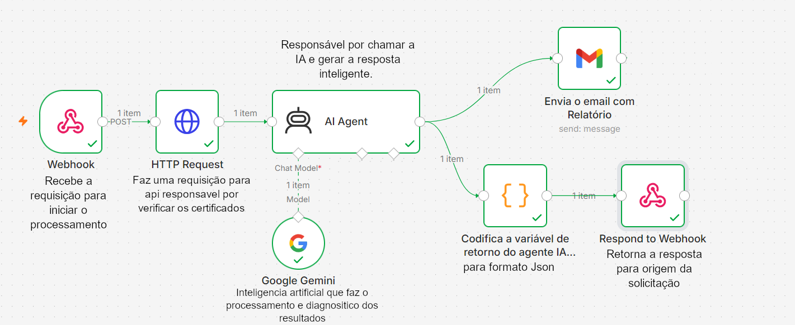

# Auditoria Automática SSL/TLS

Utilizamos a ferrementa n8n para receber os dados enviados pelo site, chamar api que executa a análise SSL/TLS do domínio informado, processar os dados com IA, gerar o relatório, enviar o resultado por e-mail e retornar o resultado para origem.

## Fluxo De Funcionamento do N8N



## 1. Webhook

O node Webhook é a porta de entrada do backend. Ele recebe os dados enviados pelo formulário do site:

```json
{
  "email": "usuario@email.com",
  "url": "google.com"
}
```

### 1.1 Configuração principal

- Método: `POST`
- Path: `/auditoria-ssl` ou ID do webhook
- Respond: `Using Respond to Webhook Node`

Esse nó recebe a requisição sempre que acionado quando o usuário clica em "Iniciar Auditoria" no html/site.

### 1.2 Função no projeto

- Coletar o e-mail do usuário.
- Coletar o domínio que será analisado.
- Iniciar automaticamente o processo de auditoria.

## 2. HTTP Request

O nó HTTP Request faz a comunicação com a API responsável por analisar os certificados. Ele envia o domínio recebido no webhook para o endpoint:

```text
https://whoisjson.com/api/v1/ssl-cert-check?domain={dominio}
```

utilizamos a api whoisjson que faz as verificações e retorna em formato json

## 3. AI Agent

O nó AI Agent recebe os dados técnicos retornados pelo requisição anterior e transforma essas informações em um relatório compreensível. Ele usa o modelo Google Gemini Chat Model conectado ao nó.

A função da IA é interpretar o JSON técnico e gerar uma análise contendo:

- Coleta de informações do sistema alvo.
- Vulnerabilidades identificadas.
- Classificação de risco.
- Recomendações de correção.
- Conclusão.

Usamos o prompt abaixo para analisar as informações e retornar o relatório:

```text
Atue como um especialista em segurança digital. Analise os seguintes dados REAIS de SSL/TLS obtidos da API WhoisJSON para o domínio pesquisado: {{ JSON.stringify($json) }}.

Verifique se o campo "valid" é false, analise a proximidade da data "valid_to" para ver se o certificado vai expirar logo, e olhe os detalhes do "issuer" (emissor).

Com base nisso, monte o relatório final de vulnerabilidades, classificação de risco e recomendações seguindo estritamente a estrutura JSON que combinamos.
Além do objeto JSON que combinamos, adicione uma nova propriedade na raiz do JSON chamada "email_html". Dentro dela, gere um relatório em código HTML puro (use tags inline como <div style="...">, <table>, <h4>, <p>) estruturado de forma muito elegante, limpa e profissional, usando tons de cinza e azul escuro, pronto para ser enviado no corpo de um e-mail.
Não use blocos de código Markdown como ```json no início ou no fim. Responda estritamente com o objeto JSON válido direto.
```

Também foi adicionada uma instrução para formatar a resposta :

```
{
  "status": "vulneravel ou seguro",
  "classificacao_risco": "Alto, Medio ou Baixo",
  "vulnerabilidades": [
    {
      "item": "Nome do problema real encontrado",
      "descricao": "Explicação técnica simplificada",
      "recomendacao": "O que o administrador do servidor deve fazer"
    }
  ],
"email_html": "<div style='font-family: Arial...'>...</div>"
}
```

### 3.1 Função no projeto

- Interpretar os dados técnicos.
- Identificar vulnerabilidades.
- Classificar os riscos.
- Sugerir ações corretivas.
- Gerar um relatório legível para o usuário.

## 4. Google Gemini Chat Model

Esse nó fica conectado ao AI Agent como modelo de linguagem. Ele é responsável por executar a análise textual usando inteligência artificial.

### 4.1 Configuração geral

- Modelo: Gemini.
- Função: Chat Model do AI Agent.

### 4.2 Função no projeto

- Fornecer inteligência artificial ao processo.
- Transformar dados técnicos em análise de segurança.
- Gerar explicações e recomendações.

## Aqui temos uma bifurcação do fluxo onde enviamos o email com relatório e códificamos para json

## 5. Codificador

Esse nó é responsável por garantir a codificação JSON para retornar a saída e enviar à origem.

Ele cria um campo chamado `dados_servidor`. Esse campo recebe o conteúdo gerado pelo AI Agent:

```
return JSON.parse($input.item.json.output);
```

A ideia é garatir o padrão JSON mostrado abaixo.

{
  "status": "vulneravel ou seguro",
  "classificacao_risco": "Alto, Medio ou Baixo",
  "vulnerabilidades": [
    {
      "item": "Nome do problema real encontrado",
      "descricao": "Explicação técnica simplificada",
      "recomendacao": "O que o administrador do servidor deve fazer"
    }
  ],
"email_html": "<div style='font-family: Arial...'>...</div>"
}

## 5.1 Gmail - Send a Message

O nó Gmail envia o relatório gerado para o e-mail informado pelo usuário no formulário.

O campo `To` utiliza o e-mail recebido pelo Webhook:

```
{{ $node["Webhook"].json["body"]["email"] }}
```

O campo `Message` utiliza o relatório organizado:

```
{{ JSON.parse($json.output).email_html }}
```

### 6.1 Configuração geral

- Resource: `Message`.
- Operation: `Send`.
- Email Type: `HTML`.

Como o relatório é gerado em HTML, o e-mail chega formatado visualmente para o usuário.

### 6.2 Função no projeto

- Enviar automaticamente o relatório para o usuário.
- Entregar o resultado da auditoria por e-mail.

## 7. Respond to Webhook

O nó Respond to Webhook devolve uma resposta para a origem da requisição após a execução. Ele permite que o relatório também apareça na tela do usuário, além de ser enviado por e-mail.

### 7.1 Configuração usada

- Respond With: `First incoming Item`.

Assim, o frontend recebe o conteúdo do relatório e exibe na página.

### 7.2 Função no projeto

- Retornar o relatório para o site.
- Permitir a visualização do resultado na tela.
- Finalizar a requisição do formulário web.

## Funcionamento completo

Quando o usuário acessa o site e preenche o formulário:

- E-mail: `usuario@email.com`.
- Domínio: `google.com`.

O site envia os dados para o Webhook do backend. Em seguida, o backend:

1. Recebe e-mail e domínio pelo Webhook.
2. Envia o domínio para a API do WhoisJSON.
3. Recebe os dados técnicos da análise SSL/TLS.
4. Envia esses dados para o AI Agent.
5. A IA interpreta os dados e gera um relatório.
6. O coficador garante o formato JSON. O Gmail envia o relatório para o usuário.
7. O Respond to Webhook devolve o relatório para aparecer no site.

## Relação com os requisitos do trabalho

O backend atende aos requisitos da atividade da seguinte forma:

- Coletar informações do sistema alvo: Webhook + HTTP Request.
- Identificar vulnerabilidades: HTTP Request + AI Agent.
- Classificar e apresentar riscos: AI Agent.
- Sugerir medidas corretivas: AI Agent.
- Gerar relatório: AI Agent + Gmail + Respond to Webhook.
- Automatizar o processo: n8n integrando todos os nodes.


### Utilização de IA
Além do uso solicitado para a própria finalidade do projeto, também utilizamos Inteligência Artificial para nos ajudar a entender o funcionamento do N8N, pois não tinhamos contanto com a ferramenta até o momento da execução da atividade. Utilizamos o Gemini dentro do projeto, por conta de familiaridade e uso em outros projetos API. O mesmo foi utilizado para realizar está atividae. Os Prompts utilizados estão anexados.

